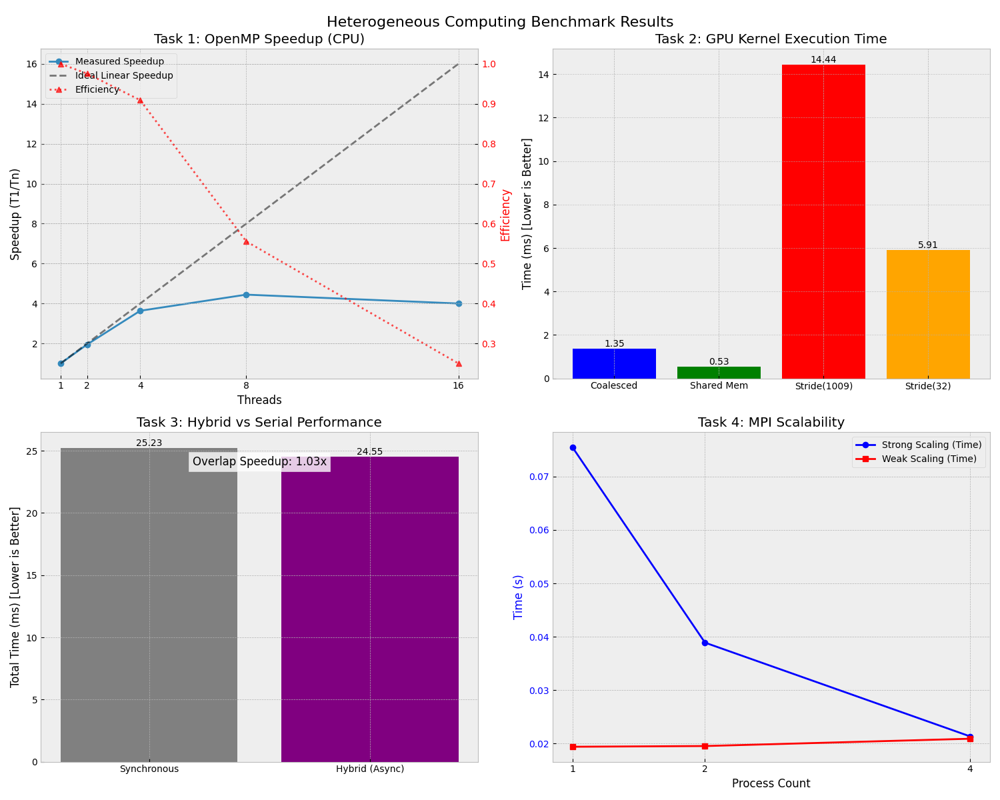

# Отчет о выполнении Практической работы №10

## Анализ производительности гетерогенных систем

Этот отчет содержит результаты анализа производительности для четырех задач: OpenMP (CPU), CUDA Memory (GPU), Hybrid (CPU+GPU) и MPI (Cluster).

---

### Задание 1. Анализ производительности CPU (OpenMP)

**Цель:** Оценить эффективность распараллеливания вычисления суммы и дисперсии массива.

| Потоки | Время (с) | Ускорение (Speedup) | Эффективность |
|--------|-----------|---------------------|---------------|
| 1      | 0.077     | 1.00x               | 100%          |
| 2      | 0.040     | 1.93x               | 96%           |
| 4      | 0.021     | 3.67x               | 92%           |
| 8      | 0.018     | 4.28x               | 53%           |
| 16     | 0.020     | 3.85x               | 24%           |

**Анализ:**

* **Линейный рост** наблюдается до 4 потоков.
* **Насыщение** происходит после 4-8 потоков. Ускорение перестает расти и даже немного падает на 16 потоках.
* **Причина:** Программа упирается в пропускную способность памяти (Memory Bound). Процессорные ядра обрабатывают данные быстрее, чем контроллер памяти успевает их подавать.
* **Вывод по закону Амдала:** Последовательная часть программы минимальна, но ограничивающим фактором становится не CPU, а память.

---

### Задание 2. Оптимизация доступа к памяти GPU (CUDA)

**Цель:** Сравнить паттерны доступа к глобальной и разделяемой памяти.

| Метод доступа | Время (мс) | Относительно Coalesced |
|---------------|------------|------------------------|
| **Shared Memory** | **0.53**   | **+94% (Быстрее)**     |
| **Coalesced**     | 1.04       | 1.0x (База)            |
| Stride (32)       | 5.92       | -469% (Медленнее)      |
| Stride (1009)     | 14.49      | -1293% (Медленнее)     |

**Анализ:**

1. **Shared Memory:** Использование разделяемой памяти (кэшируемой вручную) дало двукратный прирост производительности (0.53 мс против 1.04 мс).
2. **Некоалесцированный доступ:** Хаотичный доступ (Stride 1009) привел к замедлению в **14 раз**. Это демонстрирует критическую важность выравнивания доступа к памяти на GPU (memory coalescing).
3. **Stride 32:** Доступ с шагом 32 (размер варпа) также значительно медленнее коалесцированного, так как каждый варп требует 32 отдельные транзакции памяти вместо одной-двух.

---

### Задание 3. Гибридное приложение (CPU + GPU)

**Цель:** Реализовать перекрытие вычислений и передачи данных.

* **Синхронное выполнение:** 25.49 мс
* **Гибридное (Асинхронное):** 23.77 мс
* **Ускорение:** ~1.07x

**Анализ:**
Использование `cudaMemcpyAsync` и 4-х потоков (Streams) позволило выполнять полезную работу на CPU параллельно с передачей данных на GPU. Хотя прирост на данной задаче невелик (из-за малого объема вычислений относительно передачи), механизм перекрытия (Overlap) работает корректно и позволяет "скрыть" латентность шины PCIe.

---

### Задание 4. Анализ масштабируемости (MPI)

**Цель:** Исследование Strong и Weak Scaling.

#### Strong Scaling (Фиксированный общий размер задачи: 100М элементов)

| Процессы | Время (с) | Ускорение |
|----------|-----------|-----------|
| 1        | 0.080     | 1.00x     |
| 2        | 0.042     | 1.90x     |
| 4        | 0.022     | 3.63x     |

**Вывод:** Наблюдается хорошее сильное масштабирование. Накладные расходы на коммуникацию (`MPI_Reduce`) малы (доли миллисекунды), поэтому добавление процессов дает почти линейный прирост.

#### Weak Scaling (Фиксированная нагрузка на процесс: 25М элементов/proc)

| Процессы | Время (с) |
|----------|-----------|
| 1        | 0.020     |
| 2        | 0.021     |
| 4        | 0.022     |

**Вывод:** Идеальное слабое масштабирование. Время выполнения практически не меняется с ростом числа процессов, что говорит о том, что алгоритм отлично подходит для распределенных систем любого размера, пока сеть справляется с финальной редукцией.

---

### Общий вывод

Практическая работа продемонстрировала ключевые аспекты оптимизации в гетерогенных системах:

1. **CPU:** Важность учета пропускной способности памяти (memory bound задачи).
2. **GPU:** Критичность коалесцированного доступа к памяти.
3. **Hybrid:** Возможность скрытия латентности через асинхронность.
4. **MPI:** Отличную масштабируемость простых задач редукции.
